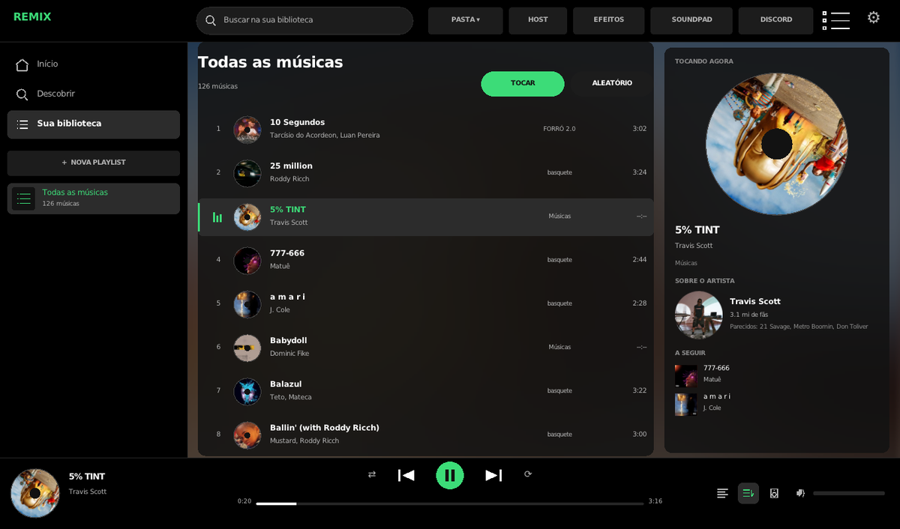
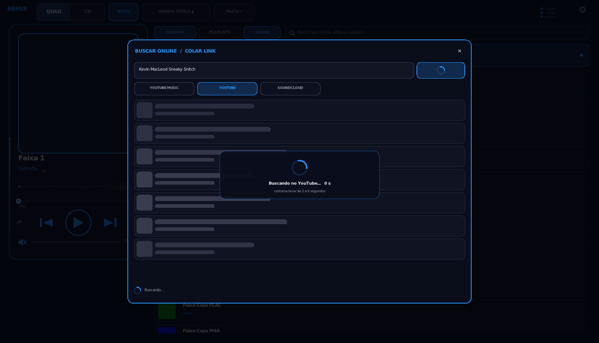
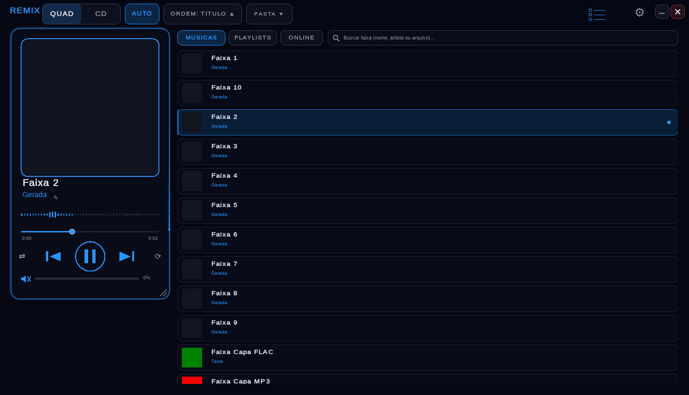

# Remix Player

A lightweight music player for **Windows and Linux** (C++, one shared core, ~3 MB). Play your local
library, organize playlists and stream or download music from **YouTube, YouTube Music, SoundCloud,
Spotify, Deezer and Apple Music** links.

> The interface is currently in Brazilian Portuguese. Documentação em português: [README.pt-BR.md](README.pt-BR.md).

<p align="center">
  
  
  
</p>

## Credits

<p align="center">
  <a href="https://github.com/Nero-2077"></a>
  <a href="https://github.com/NinjaZinS2"></a>
</p>

**[Nero-2077](https://github.com/Nero-2077)** created Remix: the original idea and the Windows version.
**Sodre** ([NinjaZinS2](https://github.com/NinjaZinS2)) joined later as co-developer: worked on the Windows version,
proposed and built playlists and online music (streaming and downloads), and brought Remix to Linux.

## Download

Portable builds are on the [Releases page](https://github.com/EchoGroupStudio/Remix/releases), nothing to install:

| System | File |
|---|---|
| Windows 10/11 (x64) | `remix-<version>-windows-x64-portable.zip`: extract the whole folder and run `Remix.exe` |
| Linux (x86_64, any distro) | `remix-<version>-linux-x86_64-portable.zip`: extract and run `./RODAR.sh` |

Linux builds only need glibc 2.27 or newer (Ubuntu 18.04+, Debian 10+, Fedora...). A `.deb`, a `.rpm` and an
AppImage can be built with `bash linux/packaging/build-packages.sh` (see [Building from source](#building-from-source)).

### Online music requirements

Streaming, downloads and online search use free external tools that are **not bundled**: **yt-dlp**, **FFmpeg**
and a JavaScript runtime, which YouTube now requires (**Deno 2.3+** or **Node.js 22+**). The portable versions
include an installer:

- **Windows:** double-click `INSTALAR-DEPENDENCIAS.bat` in the Remix folder. It downloads the official yt-dlp,
  FFmpeg and Deno builds straight into `assets\tools` **inside** Remix, using the `curl` and `tar` built into
  Windows 10 1803+ and 11 — nothing is installed globally (no pip, no winget, no PATH). Remix only loads these
  tools from its own `assets\tools` folder. On Windows without `curl`/`tar` it opens App Installer in the
  Microsoft Store or the official download pages.
- **Linux:** `bash instalar-dependencias.sh` in the portable folder. It detects the distribution and uses its package
  manager (apt on Debian/Ubuntu/Mint, dnf on Fedora/Nobara/RHEL, pacman on Arch/Manjaro/CachyOS, zypper on openSUSE,
  xbps on Void, eopkg on Solus). When the packaged yt-dlp or JavaScript runtime is too old, on immutable systems
  (Bazzite, Silverblue, SteamOS) or without sudo, it downloads the official yt-dlp, Deno and static FFmpeg builds into
  `~/.local/bin` and `~/.deno/bin`. On NixOS it prints the `nix` command instead; `--mostrar` only shows the plan.

Then just open Remix: it finds the tools by itself, no restart needed. *Settings › ONLINE* shows what was found.
Run the installer again from time to time: YouTube changes often and yt-dlp must stay up to date.

### If Remix closes by itself (Windows)

Remix writes `remix-log.txt` next to `Remix.exe` (or in `%LOCALAPPDATA%\Remix`) with every startup step, the
Windows version, the audio device and the error, and shows a message instead of just disappearing. The next launch
starts in **safe mode** (no splash sound, effects, tray icon or global hotkeys; force it with `Remix.exe --seguro`).
Please open an issue with that file. Also check that the whole folder was extracted (do not run `Remix.exe` from
inside the `.zip`) and that your antivirus did not quarantine it.

## Features

**Library**
- Scans your Music, Downloads, Documents and Desktop folders (skipping game and app folders) or a folder you choose, and watches it for changes.
- MP3, WAV, FLAC and OGG built in; M4A, AAC, Opus, WMA and more through ffmpeg.
- Tags and **embedded cover art** (MP3, M4A/MP4, FLAC, OGG/Opus, WAV/AIFF); custom covers from a file or a web image search.
- Search, sorting (title, artist, file, date or manual), rename or delete files, edit artist names.

**Playlists**
- Each playlist is `playlists/<name>/playlist.json` with file paths only: nothing is copied.
- Add songs from the library, pick files, add a whole folder, **link a folder** (always in sync), paste a link or search online.
- Files that moved are found again by name and size. Shuffle is a play queue, so your custom order stays intact.

**Online music**
- Search YouTube Music, YouTube or SoundCloud, or paste links to tracks, albums and playlists from YouTube / YouTube Music, SoundCloud, **Spotify, Deezer and Apple Music**.
- Spotify, Deezer and Apple Music links provide title, artist and duration (Spotify through its public embed page: no account or API key), and each song is matched on YouTube Music. No DRM is circumvented: audio always comes from YouTube or SoundCloud.
- **In-memory streaming:** yt-dlp finds the audio URL and ffmpeg decodes straight to RAM. Nothing is written to disk and seeking works.
- **Streaming queue:** the current song and the next two each get their own channel and preload in the background, so skipping (or reaching the end of a song) starts the next one instantly.
- **Downloads** (MP3, M4A or the original format, with tags and cover) run in a background queue; files are assembled in the cache and moved to `Music/Remix Online/<playlist>` only when complete.
- Streaming or download can be chosen globally or per playlist. A small journal in the cache lets the app clean up interrupted downloads on the next start.

**Look and feel**
- Square, CD or compact vertical layout; grid or list; themes; LED glow, particles and glitch effects (with a light mode for slower PCs); 8-band equalizer.

**Desktop integration**
- Keeps playing in the background when the window is closed (optional).
- Windows: tray icon and media keys. Linux: MPRIS (desktop media applet, media keys, `playerctl`).
- Configurable hotkeys, each one FOCUS (only while Remix is active) or GLOBAL; `remix --cmd next` for desktop shortcuts on Wayland.
- Single instance: opening a file hands it to the running player.

## Building from source

```bash
git clone https://github.com/EchoGroupStudio/Remix.git
cd Remix
```

### Linux

Nothing is installed system-wide: dependencies are downloaded into `third_party/`.

```bash
bash linux/fetch-deps.sh                 # raylib 5.5 (+ GLFW patch), zig 0.13, X11/Wayland headers
bash linux/build.sh                      # -> build/remix and linux/remix
bash linux/RODAR.sh                      # builds if needed, then runs
bash linux/packaging/build-packages.sh   # .deb, .rpm, portable zip and AppImage in dist/
bash linux/build-windows.sh              # cross-compiles windows/Remix.exe with MinGW-w64
```

### Windows

Double-click `windows\COMPILAR.bat`. It uses MinGW-w64 GCC (MSYS2 UCRT64, WinLibs, Scoop or Chocolatey)
and explains how to install it when missing. Manual commands: [windows/LEIA-ME.txt](windows/LEIA-ME.txt).

## Project layout

| Folder | Contents |
|---|---|
| `comum/` | shared core: player (miniaudio), library, playlists, layout, input, online streaming and downloads |
| `linux/` | Linux shell (raylib), MPRIS, X11 hotkeys, build and packaging scripts |
| `windows/` | Windows shell (Win32 + GDI+), icon/manifest resources, `COMPILAR.bat` |
| `assets/` | branding, fonts and themes |
| `docs/` | extra documentation (Portuguese) and screenshots |

Run from the project folder (or a portable zip), Remix keeps `config.ini`, `covers.ini`, `artists.ini` and
`playlists/` next to it. Installed packages and the AppImage use `~/.config/remix`. Caches live in
`~/.cache/remix` (Linux) or `%TEMP%\remix-cache` (Windows).

## Command line

```text
remix [file]                 play a file (reuses the running instance)
remix --cmd <action>         playpause, next, prev, volup, voldown, mute, shuffle, repeat, show, hide, quit
remix --home <folder>        use another folder for settings and library (portable mode)
```

## License

Remix Player is released under the [Apache License 2.0](LICENSE). Bundled third-party code keeps its own
license: raylib and GLFW (zlib), miniaudio and stb (public domain / MIT), DejaVu fonts (Bitstream Vera) and
Droid Sans Japanese (Apache 2.0). See [linux/packaging/copyright](linux/packaging/copyright). yt-dlp and ffmpeg
are separate programs and are not distributed with Remix.

Please respect each platform's terms of service and the copyright law of your country: download only what
you have the right to.
